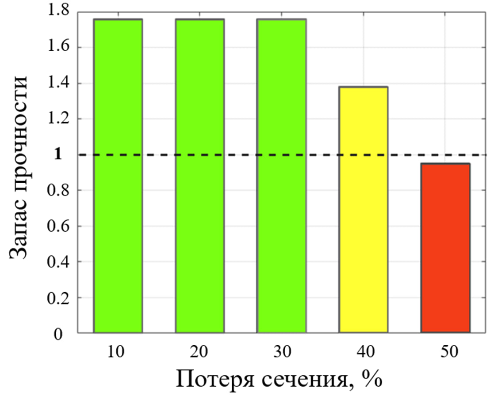

## Анализ прочности каркаса металлопластиковой трубы с дефектами

Здесь представлен небольшой обзор научно-исследовательской работы на тему "Анализ прочности каркаса металлопластиковой трубы с дефектами"

[полная версия работы](https://github.com/KatlinBulycheva/bachelor-thesis/blob/master/%D0%92%D0%9A%D0%A0.pdf)

### Объект исследования

В проекте анализируется армированная металлополимерная труба (или коротко МПТ). Конструкция представляет собой комбинацию решетчатого стального каркаса и полимерной матрицы, защищающую каркас от агрессивных сред.

МПТ объединяют в себе лучшие характеристики привычных нам стальных и пластиковых труб и славятся обширной областью применения. По большей части такие трубы применяются в нефтяной и химической промышленности.

### Методика анализа МПТ

Данная схема иллюстрирует методику анализа технического состояния трубопровода, согласно которой сначала проводится неразрушающий контроль.

<image
  src="./images/scheme.png"
  alt="Методика анализа МПТ"
  width='60%'>

Иными словами, в полевых условиях выполняется внутритрубная диагностика с помощью магнитных и ультразвуковых дефектоскопов. После, полученные диагностические параметры используются для построения механической модели трубы. Механическая модель позволяет преобразовать диагностическую информацию в механические показатели несущей способности, например, в коэффициент запаса прочности, который применяется для оценки прочности и прогноза ресурса.

Однако точный прогноз возможен только при наличии представления о критическом состоянии конструкции. Поэтому здесь большую роль играет критерий браковки, который может быть установлен с помощью модельных расчетов, либо в сочетании с определенными экспериментальными данными.

### Цель работы

При постановке цели были сформулированы следующие подзадачи: 

1.	Построение модели каркаса в системе ANSYS и в дополнение оцифровка документации МПТ в системе Siemens NX.

    

<em>Модель в SiemensNX</em>

2.	Анализ напряженно-деформированного состояния при отсутствии и при наличии дефектов. Что такое дефекты? Это типы разрушения каркаса, которые могут быть в виде локальных дефектов (обрывы проволок) и в виде распределенных дефектов (потеря сечения проволоки из-за коррозионного износа). 
3.	Построение диаграммы предельной кривой.

### Расчет каркаса без дефектов

Анализ механического состояния начался с каркаса без дефектов.

**Расчетная модель и деформации**

На рисунке *слева* представлена конечно-элементная (КЭ) модель в виде сегмента, так как каркас без дефектов симметричен. Давление 2 МПа задавалось эквивалентными сосредоточенными усилиями в местах контактной сварки. В качестве условных закреплений выбрана заделка, ограничивающая 120 мм длины трубы. 

На рисунке *справа* показана эпюра деформирования в цилиндрической системе координат. 

**Продольные и изгибные напряжения**

Осевые напряжения (рисунок *слева*), образуются в кольцевых проволоках и отсутствуют в продольных. Это означает, что спираль каркаса воспринимает основную нагрузку и работает на растяжение – сжатие. 

А вот продольные проволоки работаю на изгиб (рисунок *справа*). При этом характер напряжений имеет вид краевого эффекта, длина которого по аналитическим расчетам составляет, примерно, 40 мм. На рисунке 6 видно, что длина затухания затрагивает 7-8 ячеек, что как раз соответствует 40 мм.

Так как напряжения краевого эффекта затухают быстро, то при оценке прочности изгибными напряжениями можно пренебречь. Таким образом механический показатель составил 3.8, что означает выполнение условия прочности.

### Обрывы кольцевых проволок

Далее проведен расчет каркаса с учетом дефектов. 

Как было показано ранее, основную нагрузку от давления испытывает спиральная арматура. Поэтому, можно предположить, что в случае, например, гидроудара возможен обрыв в кольцевой проволоке. Варьируя число обрывов, исследован характер перемещений и распределение напряжений. 

**Деформации и перемещения**

Выше на рисунке представлены вид деформирования в предкритичном состоянии (1 обрыв) и критичном (3 обрыва). В первом случае расхождение проволок составляет пол миллиметра, а во втором расхождение увеличилось, примерно, на 20%.

**Продольные напряжения**

На эпюрах продольных напряжений видно, что область дефекта является концентратором напряжений, и максимальные значения сосредоточены на соседних окружных проволоках от места обрыва. 

**Изгибные напряжения**

По характеру и численным значениям изгибных напряжений можно сказать, что при вычислении запаса прочности пренебречь этими напряжениями уже не удастся и их необходимо учитывать в расчете.

**Изменение несущей способности МПТ**

 

Для наглядного представления того, как влияет количество обрывов на коэффициент запаса прочности, была построена диаграмма, связывающая эти факторы. На рисунке *слева* видно, что 3 обрыва – это критичный фактор. И при последующих обрывах в трубе может образоваться магистральная трещина, как на рисунке *справа*.

### Потеря сечения проволоки. Коррозия

Далее в каркасе была учтена потеря сечения проволок вследствие коррозии.

Модельно это было осуществлено как уменьшение площади сечения проволоки, используя нижепредставленную формулу. 

**Напряженно-деформированное состояние**

Напряженно-деформированное состояние аналогично случаю каркаса без дефектов. Естественно, что в зоне с распространившейся коррозией, будут потенциально опасные сечения конструкции.

**Изменение несущей способности МПТ**

Варьируя процент потери сечения, построена следующая диаграмма изменения несущей способности. 

Здесь видно, что критическое состояние наступает при 40-50%. Однако в действительности, коррозия настолько сильно не повреждает арматуру. Обычно встречаются дефекты до 20% максимум. Таким образом, коррозионный износ не столь существенен для МПТ по сравнению с обрывами проволок.

### Предельная кривая. Диагностика

### Заключение и выводы